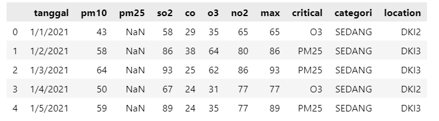
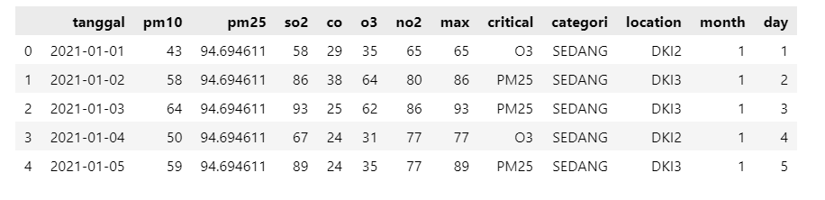
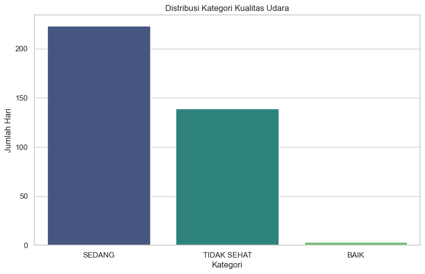
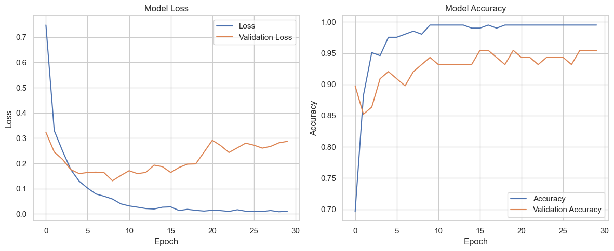

# Prediksi Kualitas Udara Menggunakan Neural Network pada Data Polusi di Provinsi DKI Jakarta

## Ringkasan

Proyek ini bertujuan untuk memprediksi tingkat polusi udara berdasarkan data indeks pencemar udara dari Provinsi DKI Jakarta pada tahun 2021. Data ini mencakup berbagai jenis polutan udara dan informasi tanggal yang relevan. Permasalahan utama adalah menentukan sejauh mana data polusi udara dapat diprediksi dengan akurat menggunakan model machine learning.

## Permasalahan

- Memprediksi nilai indeks pencemar udara berdasarkan data fitur seperti PM10, PM2.5, SO2, CO, O3, NO2, bulan, dan hari.
- Mengklasifikasikan kategori kualitas udara berdasarkan nilai indeks pencemar.

## Model

Model awal menggunakan neural network untuk regresi untuk memprediksi nilai kontinu.
Model dikembangkan menjadi model klasifikasi untuk mengelompokkan kualitas udara ke dalam kategori seperti "BAIK", "SEDANG", "TIDAK SEHAT", dan "BERBAHAYA".

## Penjelasan Dataset, EDA, dan Proses Features Dataset

- Penjelasan Dataset:
- Dataset: Indeks Standar Pencemar Udara di Provinsi DKI Jakarta 2021.csv
- Fitur Utama:
  - pm10: Particulate Matter 10
  - pm25: Particulate Matter 2.5
  - so2: Sulfur Dioxide
  - co: Carbon Monoxide
  - o3: Ozone
  - no2: Nitrogen Dioxide
  - tanggal: Tanggal pengukuran

## EDA (Exploratory Data Analysis)

` # Handle missing values`

` df['pm25'].fillna(df['pm25'].mean(), inplace=True)`

`# Convert 'tanggal' to datetime`

`df['tanggal'] = pd.to_datetime(df['tanggal'])`
`df['month'] = df['tanggal'].dt.month`
`df['day'] = df['tanggal'].dt.day`

- Missing Values: Penanganan nilai yang hilang dengan imputasi nilai rata-rata untuk kolom pm25.
- Datetime Conversion: Konversi kolom tanggal menjadi format datetime dan ekstraksi fitur month dan day.

## Proses Features Dataset

- Feature Selection: Memilih fitur yang relevan untuk model, termasuk PM10, PM2.5, SO2, CO, O3, NO2, bulan, dan hari.
- Feature Engineering: Ekstraksi informasi tambahan dari kolom tanggal untuk meningkatkan kualitas fitur.

## Proses Modeling

1. Model Regresi

Arsitektur: Neural Network dengan 3 lapisan tersembunyi (64, 32, 16 neuron) dan satu lapisan output.
Aktivasi: relu untuk lapisan tersembunyi, linear untuk lapisan output.
Loss Function: MeanSquaredError untuk regresi.
Optimizer: Adam dengan learning rate 0.01.

2. Model Klasifikasi

Arsitektur: Neural Network dengan 3 lapisan tersembunyi (64, 32, 16 neuron) dan satu lapisan output dengan fungsi aktivasi softmax.
Loss Function: sparse_categorical_crossentropy untuk klasifikasi.
Encoder: LabelEncoder dan OneHotEncoder untuk konversi label kategori.

### Alur Training

1. Data Splitting: Pembagian data menjadi set pelatihan dan pengujian.
2. Normalisasi: Normalisasi fitur menggunakan StandardScaler.
3. Training: Melatih model dengan data pelatihan, menggunakan validasi silang untuk penilaian.

## Performa Model

Epoch 1/50
7/7 ━━━━━━━━━━━━━━━━━━━━ 2s 44ms/step - loss: 1.1006 - sparse_categorical_accuracy: 0.4035 - val_loss: 0.5872 - val_sparse_categorical_accuracy: 0.8295
Epoch 2/50
7/7 ━━━━━━━━━━━━━━━━━━━━ 0s 8ms/step - loss: 0.4599 - sparse_categorical_accuracy: 0.8710 - val_loss: 0.2648 - val_sparse_categorical_accuracy: 0.8523
Epoch 3/50
7/7 ━━━━━━━━━━━━━━━━━━━━ 0s 10ms/step - loss: 0.2222 - sparse_categorical_accuracy: 0.9490 - val_loss: 0.2567 - val_sparse_categorical_accuracy: 0.8523
Epoch 4/50
7/7 ━━━━━━━━━━━━━━━━━━━━ 0s 9ms/step - loss: 0.2392 - sparse_categorical_accuracy: 0.9514 - val_loss: 0.1981 - val_sparse_categorical_accuracy: 0.8864
Epoch 5/50
7/7 ━━━━━━━━━━━━━━━━━━━━ 0s 8ms/step - loss: 0.1150 - sparse_categorical_accuracy: 0.9497 - val_loss: 0.2016 - val_sparse_categorical_accuracy: 0.8977
Epoch 6/50
7/7 ━━━━━━━━━━━━━━━━━━━━ 0s 15ms/step - loss: 0.1182 - sparse_categorical_accuracy: 0.9614 - val_loss: 0.1329 - val_sparse_categorical_accuracy: 0.9545
Epoch 7/50
7/7 ━━━━━━━━━━━━━━━━━━━━ 0s 8ms/step - loss: 0.0888 - sparse_categorical_accuracy: 0.9859 - val_loss: 0.1524 - val_sparse_categorical_accuracy: 0.9091
Epoch 8/50
7/7 ━━━━━━━━━━━━━━━━━━━━ 0s 10ms/step - loss: 0.0523 - sparse_categorical_accuracy: 0.9918 - val_loss: 0.1736 - val_sparse_categorical_accuracy: 0.9091
Epoch 9/50
7/7 ━━━━━━━━━━━━━━━━━━━━ 0s 8ms/step - loss: 0.0777 - sparse_categorical_accuracy: 0.9829 - val_loss: 0.2280 - val_sparse_categorical_accuracy: 0.8977
Epoch 10/50
7/7 ━━━━━━━━━━━━━━━━━━━━ 0s 8ms/step - loss: 0.0427 - sparse_categorical_accuracy: 0.9944 - val_loss: 0.1569 - val_sparse_categorical_accuracy: 0.9432
Epoch 11/50
7/7 ━━━━━━━━━━━━━━━━━━━━ 0s 9ms/step - loss: 0.0582 - sparse_categorical_accuracy: 0.9951 - val_loss: 0.1793 - val_sparse_categorical_accuracy: 0.9432
Epoch 12/50
7/7 ━━━━━━━━━━━━━━━━━━━━ 0s 9ms/step - loss: 0.0519 - sparse_categorical_accuracy: 0.9932 - val_loss: 0.2235 - val_sparse_categorical_accuracy: 0.9432
Epoch 13/50
...
Epoch 50/50
7/7 ━━━━━━━━━━━━━━━━━━━━ 0s 9ms/step - loss: 0.0024 - sparse_categorical_accuracy: 0.9988 - val_loss: 0.3836 - val_sparse_categorical_accuracy: 0.9318
3/3 ━━━━━━━━━━━━━━━━━━━━ 0s 4ms/step - loss: 1.0730 - sparse_categorical_accuracy: 0.9531`
Mean Squared Error: 0.945205450057983

Mean Squared Error (MSE):0.945205450057983
Plot Loss: Grafik kehilangan pelatihan dan validasi selama epoch.

## Diskusi Hasil dan Kesimpulan

Menunjukkan nilai prediksi yang sesuai dengan tren data historis. Namun, model regresi mungkin tidak memberikan interpretasi yang mudah tentang kategori kualitas udara.
Model Klasifikasi:

Model klasifikasi memberikan hasil yang lebih mudah diinterpretasikan dalam bentuk kategori kualitas udara.
Evaluasi menunjukkan bagaimana model dapat membedakan antara kategori kualitas udara dengan akurasi yang memadai.

- Regresi: Model regresi memberikan prediksi nilai kontinu yang berguna untuk analisis lebih mendalam tetapi kurang informatif untuk kategori kualitas udara.
- Klasifikasi: Model klasifikasi memberikan output yang lebih langsung dan berguna untuk pengambilan keputusan terkait kualitas udara.
